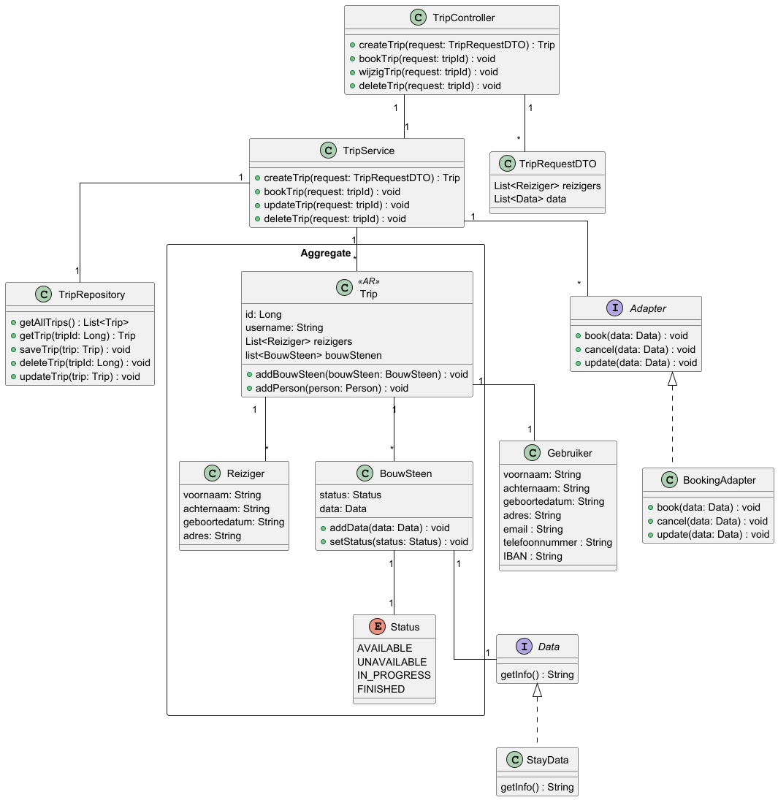

# 1. Design Patten ADR

**Datum:** 28-03-2025

## Status

Accepted

## Context

Er moet een design pattern gekozen worden zodat er op een goede manier verschillende boekingsservices in de applicatie kunnen worden geïntegreerd.

## Considered Options

**Adapter pattern**

Het Adapter Pattern wordt gebruikt om interfaces van bestaande boekingsservices (zoals Booking.com en Triptop) aan te passen aan een uniforme interface binnen de applicatie. Dit zorgt voor een consistente integratie en voorkomt dat de kernfunctionaliteit van de applicatie afhankelijk wordt van specifieke externe implementaties. Hierdoor kunnen nieuwe boekingsservices eenvoudig worden toegevoegd zonder dat bestaande code aangepast hoeft te worden.

Een belangrijk voordeel van dit patroon is dat het de impact van wijzigingen in externe API's minimaliseert, omdat alleen de adapter hoeft te worden bijgewerkt en niet de gehele applicatie. Daarnaast blijft de codebase schoon en overzichtelijk, omdat alle boekingsservices via dezelfde interface worden aangesproken.

Aan de andere kant brengt het Adapter Pattern extra onderhoud met zich mee, omdat voor elke boekingsservice een aparte adapter moet worden ontwikkeld en bijgehouden. Dit kan leiden tot een toename in complexiteit.

## Decision

## Consequences

