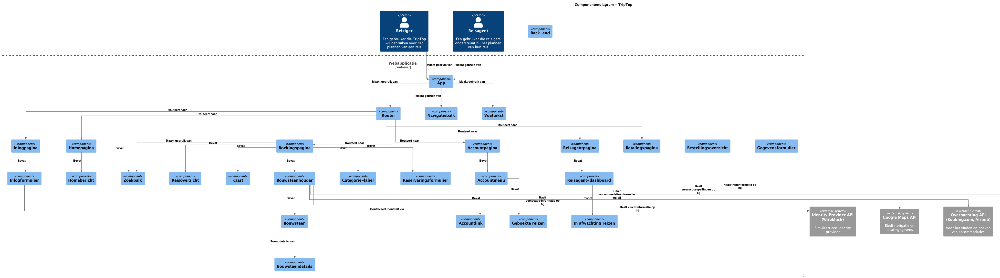
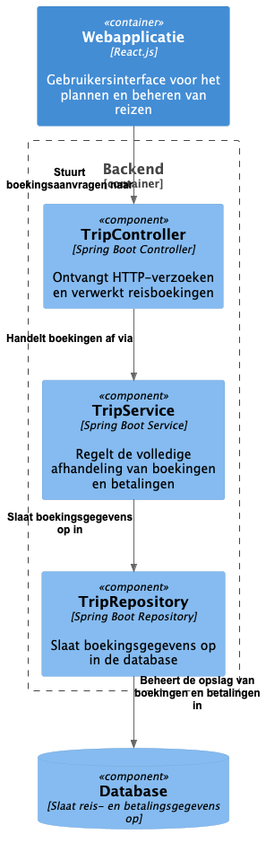

# Software Guidebook Triptop

## 1. Introduction
Dit software guidebook geeft een overzicht van de Triptop-applicatie. Het bevat een samenvatting van het volgende: 
1. De vereisten, beperkingen en principes. 
1. De software-architectuur, met inbegrip van de technologiekeuzes op hoog niveau en de structuur van de software. 
1. De ontwerp- en codebeslissingen die zijn genomen om de software te realiseren.
1. De architectuur van de infrastructuur en hoe de software kan worden geinstalleerd. 

## 2. Context
TripTop is een reisapplicatie waarmee reizigers eenvoudig hun reizen kunnen plannen en boeken. De app biedt functionaliteiten zoals het zoeken en boeken van vervoer, accommodaties en activiteiten, evenals integraties voor betalingen, gebruikersauthenticatie en navigatie. Reizigers gebruiken de app zelfstandig, terwijl reisagenten ondersteuning kunnen bieden bij het plannen van een reis.

TripTop communiceert met verschillende externe systemen. Vervoersaanbieders (bijv. NS, Uber) leveren vervoersopties, terwijl accommodatie- en activiteitenaanbieders (bijv. Booking.com, Tripadvisor) informatie en boekingsmogelijkheden bieden. Een identity provider (bijv. Google) zorgt voor inloggen, een betalingsprovider verwerkt transacties en kaartproviders (bijv. Google Maps) ondersteunen navigatie. Daarnaast biedt de app toegang tot eetgelegenheden via platforms als Thuisbezorgd en Uber Eats.

Onderstaande contextdiagram toont de relaties tussen TripTop, zijn gebruikers en externe systemen:


## 3. Functional Overview

Om de belangrijkste features toe te lichten zijn er user stories en twee domain stories gemaakt en een overzicht van het domein in de vorm van een domeinmodel. Op deze plek staat typisch een user story map maar die ontbreekt in dit voorbeeld.

### 3.1 User Stories

#### 3.1.1 User Story 1: Reis plannen

Als gebruiker wil ik een zelfstandig op basis van diverse variabelen (bouwstenen) een reis kunnen plannen op basis van mijn reisvoorkeuren (wel/niet duurzaam reizen, budget/prijsklasse, 's nachts reizen of overdag etc.) zodat ik op vakantie kan gaan zonder dat hiervoor een reisbureau benodigd is.

#### 3.1.2 User Story 2: Reis boeken

Als gebruiker wil ik een geplande reis als geheel of per variabele (bouwsteen) boeken en betalen zodat ik op vakantie kan gaan zonder dat hiervoor een reisbureau benodigd is.

#### 3.1.3 User Story 3: Reis cancelen

Als gebruiker wil ik een geboekte reis, of delen daarvan, kunnen annuleren zodat ik mijn geld terug kan krijgen zonder inmenging van een intermediair zoals een reisbureau.

#### 3.1.4 User Story 4: Reisstatus bewaren 

Als gebruiker wil ik mijn reisstatus kunnen bewaren zonder dat ik een extra account hoef aan te maken zodat ik mijn reis kan volgen zonder dat ik daarvoor extra handelingen moet verrichten.

#### 3.1.5 User Story 5: Bouwstenen flexibel uitbreiden

Als gebruiker wil ik de bouwstenen van mijn reis flexibel kunnen uitbreiden met een zelf te managen stap (bijv. met providers die niet standaard worden aangeboden zoals een andere reisorganisatie, hotelketen etc.) zodat ik mijn reis helemaal kan aanpassen aan mijn wensen.

### 3.2 Domain Story Reis Boeken (AS IS)


### 3.3 Domain Story Reis Boeken (TO BE)


### 3.4 Domain Model


## 4. Quality Attributes

Voordat deze casusomschrijving tot stand kwam, heeft de opdrachtgever de volgende ISO 25010 kwaliteitsattributen benoemd als belangrijk:
* Compatibility -> Interoperability (Degree to which a system, product or component can exchange information with other products and mutually use the information that has been exchanged)
* Reliability -> Fault Tolerance (Degree to which a system or component operates as intended despite the presence of hardware or software faults)
* Maintainability -> Modularity (Degree to which a system or computer program is composed of discrete components such that a change to one component has minimal impact on other components)
* Maintainability -> Modifiability (Degree to which a product or system can be effectively and efficiently modified without introducing defects or degrading existing product quality)
* Security -> Integrity (Degree to which a system, product or component ensures that the state of its system and data are protected from unauthorized modification or deletion either by malicious action or computer error)
* Security -> Confidentiality (Degree to which a system, product or component ensures that data are accessible only to those authorized to have access)

## 6. Principles
1. **Laagjesarchitectuur (Layered Architecture):**
   De software maakt gebruik van een gelaagde architectuur, waarbij de logica van de applicatie is verdeeld over verschillende lagen:
    - **Controller**: De `TripController` zorgt voor de interactie met de gebruiker en stuurt verzoeken naar de service laag.
    - **Service**: De `TripService` bevat de bedrijfslogica voor het beheren van reizen (zoals het aanmaken, boeken, wijzigen en verwijderen van een reis).
    - **Repository**: De `TripRepository` is verantwoordelijk voor de opslag en het ophalen van gegevens vanuit de database (in dit geval een MongoDB-repository).

2. **Aggregation:**
    - De `Trip` klasse is een voorbeeld van een **aggregate** in de Domain-Driven Design (DDD) benadering. Een `Trip` bestaat uit verschillende `BouwSteen` en `Reiziger` objecten, wat het een rijke, samengestelde entiteit.

3. **Interface en Adapter Pattern:**
    - Het **Adapter patroon** wordt toegepast via de `Adapter` interface en de concrete `VerblijfAdapter` klasse. Dit patroon maakt het mogelijk om verschillende boekingssystemen te integreren zonder de kernlogica te verstoren.
    - De interface zorgt ervoor dat er verschillende implementaties mogelijk zijn, die de specifieke logica van het boeken, annuleren en wijzigen van een reis kunnen afhandelen, afhankelijk van de provider.

4. **Encapsulatie en Data Objecten:**
    - Het gebruik van een **Data** object dat verantwoordelijk is voor het omgaan met JSON-data zorgt voor een duidelijke scheiding van de gegevensverwerking. De `Data` klasse biedt de logica voor het extraheren van waarden uit JSON-objecten.

5. **Single Responsibility Principle (SRP):**
    - Elke klasse heeft één enkele verantwoordelijkheid, bijvoorbeeld `TripController` voor het afhandelen van gebruikersverzoeken, `TripService` voor de bedrijfslogica, en `BouwSteen` voor het beheren van de status en gegevens van een reiscomponent. Dit maakt de code gemakkelijker te onderhouden en uit te breiden.

## 7. Software Architecture

###     7.1. Containers


Het **Container Diagram** van TripTop toont de hoofdcomponenten en hun interacties. **Reizigers** plannen en boeken reizen via de **Web Applicatie (React)**, terwijl **Reisagenten** ondersteuning bieden. De **Backend (Spring Boot)** verwerkt aanvragen, beheert bedrijfslogica en communiceert met externe systemen zoals **Google Maps, Open Weather, NS API, boekings- en betalingsservices**. Gegevens worden opgeslagen in een **SQL/NoSQL database**. De backend regelt ook **authenticatie en betalingen** via externe APIs. Alles verloopt via

###     7.2. Components
#### Frontend component diagram:


Dit diagram toont de componenten van de **frontend** van de reisapplicatie TripTop, die bestaat uit verschillende pagina's en componenten die door de gebruiker worden gebruikt om een reis te plannen en beheren. De applicatie is opgebouwd uit een aantal visuele en functionele elementen die met elkaar communiceren om een gebruiksvriendelijke ervaring te bieden.

De applicatie bevat componenten zoals de **inlogpagina** (loginPage), **homepagina** (homePage), **reisoverzicht** (tripOverview), **boekingspagina** (bookingPage), en **accountpagina** (accountPage), evenals aanvullende pagina's voor reisagenten (reisAgentPage) en betalingen (betalingsPage). Elke pagina bevat verschillende subcomponenten die specifiekere functies vervullen, zoals het **inlogformulier** (loginform), **accountmenu** (accountMenu), **categorie-label** (categoryLabel), **map** voor geolocatie, en **reserveringsformulier** (resevationForm).

Externe systemen worden geïntegreerd via **API's** voor verschillende diensten: de **Google Maps API** voor geolocatie-informatie, de **Open Weather API** voor weersinformatie, de **NS API** voor treinreis- en OV-informatie, de **overnachting API** voor het boeken van accommodaties, en de **vlucht API** voor vluchten. Daarnaast is er een **identity provider API** die de inloggegevens van gebruikers controleert.


Gebruikers kunnen de applicatie zowel als **reiziger** als **reisagent** gebruiken, waarbij de **reiziger** de functionaliteiten voor het plannen van een reis en het boeken van verschillende reiscomponenten kan gebruiken, terwijl de **reisagent** toegang heeft tot een dashboard voor het beheren van reisaanvragen van klanten. De applicatie biedt een uitgebreide set van interacties en is goed verbonden met de backend en externe systemen voor een complete reiservaring.


#### Backend component diagram:


Dit diagram toont de architectuur van TripTop, opgebouwd uit verschillende componenten. De applicatie bestaat uit een frontend, een webapplicatie gebouwd met React.js, en een backend, die is opgezet met Spring Boot. De frontend en backend communiceren met elkaar via HTTP/REST API-aanroepen.

De backend bevat meerdere componenten, waaronder controllers (zoals loginController en tripController) die HTTP-aanvragen ontvangen van de frontend, en services (zoals loginService en tripService) die de logica voor authenticatie en reisbeheer afhandelen. Daarnaast maakt de backend gebruik van adapters (zoals LoginAdapter, VluchtAdapter, TreinAdapter, VerblijfAdapter, BetalingsAdapter) om te communiceren met externe systemen voor vluchten, treinen, overnachtingen en betalingen. De tripRepository zorgt voor de opslag en het ophalen van reisgegevens uit een database, waarmee CRUD-operaties worden uitgevoerd.

Externe systemen die in dit diagram worden weergegeven, omvatten een identity provider voor gebruikersauthenticatie, de NS API voor treinreis-informatie, een vlucht API voor vluchtinformatie (bijvoorbeeld Google Flights of Skyscanner), een overnachting API voor accommodatie-informatie (zoals Booking.com of Airbnb), en een betaling provider voor het verwerken van betalingen (bijvoorbeeld Stripe, Adyen, of Mollie).

De relaties tussen de componenten zijn duidelijk weergegeven: de frontend maakt gebruik van de backend voor zowel authenticatie als reisbeheer, terwijl de backend via de adapters externe API's aanroept voor het boeken van reizen en het verwerken van betalingen. Gebruikersgegevens worden geverifieerd via de identity provider, en reisgerelateerde gegevens worden opgeslagen in de database
###     7.3. Dynamic Diagrams

7.3.1. Sequence Diagram Trein Reis Boeken


Dit diagram toont het proces van het boeken van een treinreis via TripTop. Het beschrijft de interactie tussen de reiziger, de webapp, backend, externe systemen zoals de NS API, betaling API, en een identity provider (WireMock).

1. De reiziger vraagt reisopties op via de webapp, die vervolgens de NS API raadpleegt voor beschikbare treinreizen.
2. Na het kiezen van een treinreis en invoeren van betaalgegevens, wordt een boekingsverzoek naar de backend gestuurd.
3. Als de gebruiker niet ingelogd is, wordt de identiteit geverifieerd via de WireMock identity provider.
4. Als de gebruiker ingelogd is, verifieert de backend de gebruiker, controleert de beschikbaarheid van de reis bij de NS API, en verwerkt de betaling via de betaling API.
5. Als de betaling succesvol is, wordt de treinreis geboekt, de reservering opgeslagen in de database, en ontvangt de reiziger een bevestiging. Bij een mislukte betaling ontvangt de reiziger een foutmelding.
6. Als de reis niet meer beschikbaar is, wordt dit gemeld en ontvangt de reiziger een foutmelding.

Het diagram toont zowel succesvolle als foutieve scenario’s in het proces.

7.3.2. Sequence Diagram Login 


Dit diagram toont het loginproces van de TripTop webapplicatie:

1. **Reiziger opent de loginpagina** en voert gebruikersnaam en wachtwoord in.
2. **Webapplicatie valideert de invoer** en stuurt een authenticatieverzoek naar de identity provider API.
3. **Succesvolle authenticatie**: De API stuurt de voor- en achternaam + token terug, en de webapp toont de pagina.
4. **Mislukte authenticatie**: De API geeft een foutmelding terug en de webapp toont een inlogfout.

Het diagram toont de communicatie tussen de reiziger, de webapplicatie en de identity provider API.

### 7.4. Design & Code

#### 7.4.1 Statische vs Dynamische data-structuur

Ik begon met de volgende ontwerpvraag: Hoe maak je de applicatie uitbreidbaar met nieuwe bouwstenen? Hierbij had ik in eerste instantie gedacht aan een Factory Pattern. Dit is een veelgebruikte ontwerppatroon dat het mogelijk maakt om objecten te maken zonder dat de client hoeft te weten hoe deze objecten zijn gemaakt. Dit maakt de applicatie uitbreidbaar, omdat nieuwe bouwstenen eenvoudig kunnen worden toegevoegd zonder dat de bestaande code hoeft te worden gewijzigd.
Uiteindelijk heb ik de een andere vraag gekregen en dat is hoe kan je data opslaan voor verschillende providers (Dynamisch vs Statische). Ik heb hiervoor een ADR opgesteld en een prototype uitgewerkt. Dit prototype is een proof of concept. Het doel van het prototype is om de haalbaarheid van de oplossing te testen en om te zien of het werkt zoals verwacht. Het prototype is ontwikkeld met behulp van Java en Spring Boot, en maakt gebruik van een NoSQL-database (MongoDB) om de gegevens op te slaan.




Hier onder het class diagram van de applicatie met de vraag uitgewerkt om dynamisch te zijn. Dit betekent dat de applicatie in staat is om gegevens van verschillende aanbieders op te slaan en te verwerken zonder dat hiervoor extra code hoeft te worden geschreven. Dit wordt bereikt door gebruik te maken van een generiek data-object wat direct JSON opslaat.


Sequence diagram:


Op code niveau:


## 8. Architectural Decision Records
1. [ADR-01: Indeling Webapplicaties](./ADR-01.md)
2. [ADR-02: Communicatie Betaling Provider](./ADR-02.md)
3. [ADR-03: Data-structuur voor verschillende providers (Dynamisch vs Statische)](./ADR-03.md)
4. [ADR-04: Factory pattern](./ADR-02.md)
5. [ADR-05: Design Patten ADR](../eigen-bijdrage-siebe/DesignPattern/ADR-DesignPattern.md)

## 9. Deployment, Operation and Support

Deze gids beschrijft hoe je een Spring Boot prototype applicatie kunt installeren en uitvoeren, inclusief het werken met HTTP bestanden voor POST requests.

## Benodigdheden

- Java JDK 17 of hoger
- Maven 3.6+
- Een IDE zoals IntelliJ IDEA, Eclipse of VS Code (optioneel)
- Git (optioneel, voor broncodebeheer)

## Installatiestappen

### 1. Java installeren en configureren
Controleer of Java correct is geïnstalleerd met:
```
java -version
```
Zorg dat de JAVA_HOME omgevingsvariabele correct is ingesteld.

### 2. Maven installeren
Controleer of Maven is geïnstalleerd met:
```
mvn -version
```
Als Maven nog niet is geïnstalleerd:
- Download Maven van [maven.apache.org](https://maven.apache.org/download.cgi)

### 3. Project verkrijgen
- Download de ZIP of kloon de repository:
```
git clone [repository-URL]
```
- Navigeer naar de hoofdmap van het project waar de pom.xml zich bevindt

### 4. Project bouwen
Voer in de projectmap het volgende commando uit:
```
mvn clean install
```
Dit compileert de code, voert tests uit en maakt een uitvoerbaar JAR-bestand.

## Applicatie uitvoeren

### 1. Start de applicatie
Gebruik een van de volgende methoden:
```
mvn spring-boot:run
```
Of na het bouwen:
```
java -jar target/[naam-van-je-jar].jar
```

### 2. Verificatie
Open een browser en ga naar:
```
http://localhost:8080
```
(of de poort die in application.properties is geconfigureerd)

## HTTP POST Requests uitvoeren

### Met een HTTP bestand
1. Open het HTTP bestand in een ondersteunende IDE (zoals IntelliJ IDEA)
2. Voer de HTTP requests rechtstreeks uit vanuit dit bestand

## Probleemoplossing

- **Poort is al in gebruik**: Wijzig de serverpoort in `application.properties` of gebruik de commandolijn-optie `-Dserver.port=8081`
- **Connectie-problemen**: Controleer firewalls en netwerkverbindingen
- **HTTP 404**: Controleer of het endpoint correct is gespecificeerd